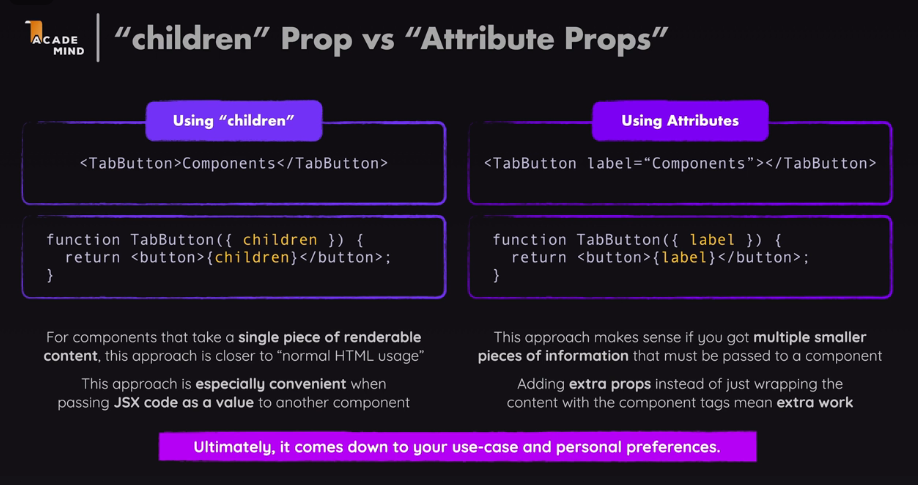

## 컴포넌트 합성
<>여는 태그와 </> 닫는 태그를 갖는 컴포넌트는 어떻게 만들면 좋을까?

```javascript
export default function TabButton(props) {
    return <li><button>{props.children}</button></li>
}
```
항상 props를 통해 넘겨 받는 속성이 있는데, 특별한 내장 `children prop`이다.


이 슬라이드는 **"children" Prop**과 **"Attribute Props"**의 차이를 설명하는 내용입니다. 각각의 방식은 컴포넌트에 데이터를 전달할 때 어떤 방식이 적합한지에 따라 다르게 사용할 수 있습니다. 각 방식에 대해 간단히 설명해 드릴게요.

### 1. **Using "children"**
- **사용 방법**: `<TabButton>Components</TabButton>` 형태로 자식 요소(여기서는 "Components")를 태그 사이에 직접 전달합니다.
- **컴포넌트 코드**:
  ```jsx
  function TabButton({ children }) {
    return <button>{children}</button>;
  }
  ```
  여기서 `children`은 컴포넌트 태그 사이에 있는 내용을 의미합니다. 예를 들어, `<TabButton>Components</TabButton>`에서는 "Components"라는 텍스트가 `children`으로 전달되어 버튼에 표시됩니다.

- **장점**: 이 방식은 HTML의 일반적인 태그 사용 방식과 유사하므로 직관적일 수 있습니다. 특히 JSX 코드를 자식 요소로 전달할 때 유용합니다.

### 2. **Using Attributes**
- **사용 방법**: `<TabButton label="Components" />` 형태로 속성(`props`)을 사용해 값을 전달합니다.
- **컴포넌트 코드**:
  ```jsx
  function TabButton({ label }) {
    return <button>{label}</button>;
  }
  ```
  여기서 `label`은 속성으로 전달된 값입니다. 예를 들어, `label="Components"`는 `label`이라는 prop을 통해 전달된 값이 버튼에 표시됩니다.

- **장점**: 여러 개의 작은 정보를 속성으로 전달해야 할 때 적합합니다. 예를 들어, 한 컴포넌트에 여러 가지 속성을 전달해야 한다면, `props`로 전달하는 방식이 더 명확할 수 있습니다.

### 결론
- **children**: 컴포넌트 태그 사이에 하나의 렌더링 가능한 내용을 전달하는 데 편리하고, HTML과 비슷한 방식으로 사용됩니다.
- **Attributes**: 더 많은 정보를 속성으로 전달해야 할 때 유용하지만, `props`가 추가되면서 코드가 조금 더 복잡해질 수 있습니다.

따라서, 어느 방식을 사용할지는 **상황**과 **개인적인 선호도**에 따라 결정하면 됩니다.